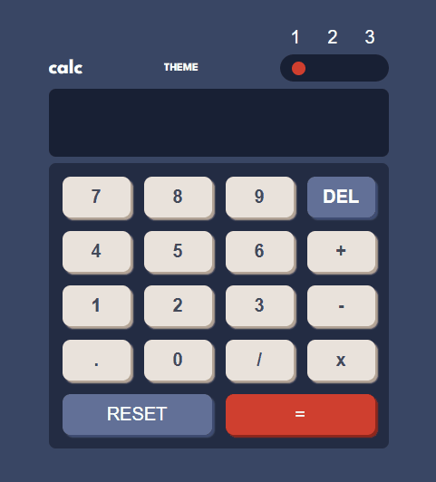

# 🖥️ Calculator

## 📜 Descrição

Calculadora de operações simples, contendo como opção a adição, subtração, multiplicação e divisão. Além de conter três temas de cores diferentes onde o usuário pode escolher o da sua preferência.

## ✍️ Processo

- Marcação semântica HTML5
- Propriedades personalizadas de CSS3
- JavaScript
- Flexbox
- Grid
- Design responsivo

### ⌨ Funcionalidades

- Escolha de três temas de cores, clicando no número e a bolinha irá mostrar qual número está o tema atual;
- Operações matemáticas de adição, subtração, multiplicação e divisão;
- Botão reset para limpar a operação;
- Botão del para limpar número por número.

## 🖱️ A página

> <a href="https://devkarine.github.io/calculator/" target= "_blank">Acesse a página online</a>

## 👩‍💻 Dev

<table align="center">
  <tr>
    <td align="center">
      

         
          <b> Karine Pereira </b> 
            
            
      

    </td>

  </tr>
</table>
